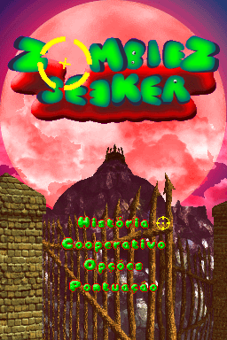
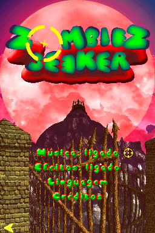
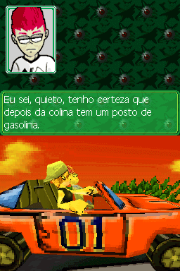
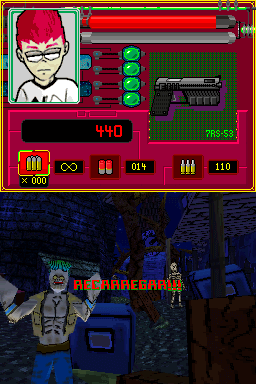
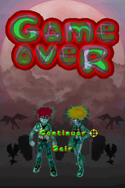

# Zombiez Seeker

## Informações sobre o jogo

| Tipo | Informação |
| ----------- | ----------- |
| Nome | Zombiez Seeker |
| Plataforma | [Nintendo DS](../) |
| Desenvolvedora | 7Raven Studios |
| Distribuidora | Zoo Games |
| Gênero | FPS |
| Data de Lançamento | 08/02/2011 |

## Informações sobre a tradução

| Tipo | Informação |
| ----------- | ----------- |
| Última versão | Sim |
| Data de Lançamento | 03/09/2018 |
| Percentual traduzido | 90% |

## Autores

| Autor(a) | Papel na tradução |
| ----------- | ----------- |
| [Kassio Cruz](../../../autores/kassio-cruz/) | Completo |

## Informações sobre patching

| Aplicar o patch no arquivo | CRC32 Hash | MD5 Hash |
| ----------- | ----------- | ----------- |
| Zombiez Seeker \(USA\) \(En,Fr,Es\)\.nds | 9269B809 | DF3CD37F2BA6AD63BF57B2AB58EE29A3 |

## Páginas sobre a tradução

| URL | Oficial (publicado pelos autores) | Possuí link de download |
| ----------- | ----------- | ----------- |
| [https://www.romhacking.net.br/index.php?topic=819](https://www.romhacking.net.br/index.php?topic=819) | Sim | Sim, porém é necessário realizar login |
| [https://joao13traducoes.com/2018/09/nds-zombies-seeker-kassio-cruz/](https://joao13traducoes.com/2018/09/nds-zombies-seeker-kassio-cruz/) | Não | Sim, porém o arquivo ou página de download exige uma senha |

## Imagens da tradução

