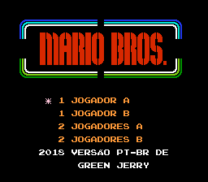
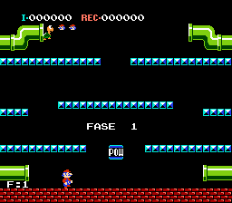
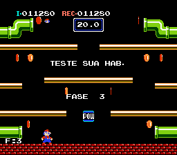
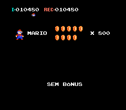
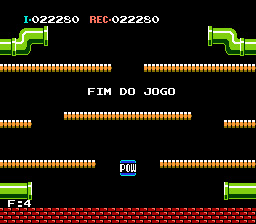

# Mario Bros.

## Informações sobre o jogo

| Tipo | Informação |
| ----------- | ----------- |
| Nome | [Mario Bros.](https://www.mobygames.com/game/7301/mario-bros/) |
| Plataforma | [Nintendo Entertainment System](../../nintendo-entertainment-system/) |
| Desenvolvedora | Nintendo |
| Distribuidora | Nintendo |
| Gênero | Ação / Plataforma |
| Data de Lançamento | 09/09/1983 |

## Informações sobre a tradução

| Tipo | Informação |
| ----------- | ----------- |
| Versão | 1.2 |
| Última versão | Sim |
| Data de Lançamento | 04/05/2019 |
| Percentual traduzido | 100% |

## Autores

| Autor(a) | Papel na tradução |
| ----------- | ----------- |
| [Green Jerry](../../../autores/green-jerry/) | Completo |

## Informações sobre patching

| Aplicar o patch no arquivo | CRC32 Hash | MD5 Hash |
| ----------- | ----------- | ----------- |
| Mario Bros. (World) | A6DE1B55 | 8D8E0B86DD870302BF4A994E76C55C83 |

## Páginas sobre a tradução

| URL | Oficial (publicado pelos autores) | Possuí link de download |
| ----------- | ----------- | ----------- |
| [https://www.romhacking.net/translations/3583/](https://www.romhacking.net/translations/3583/) | Sim | Sim |

## Imagens da tradução

