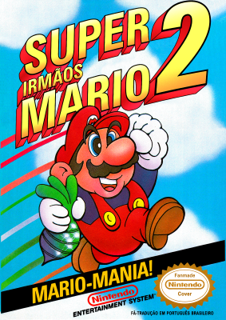
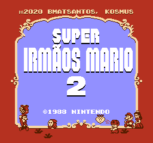
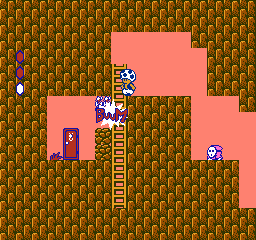
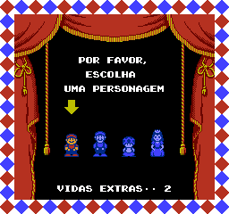
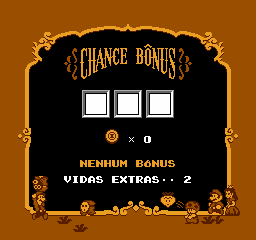
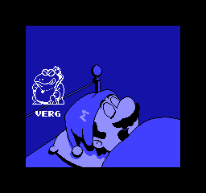

# Super Mario Bros. 2

## Informações sobre o jogo

| Tipo | Informação |
| ----------- | ----------- |
| Nome | [Super Mario Bros. 2](https://www.mobygames.com/game/7299/super-mario-bros-2/) |
| Plataforma | [Nintendo Entertainment System](../../nintendo-entertainment-system/) |
| Desenvolvedora | Nintendo |
| Distribuidora | Nintendo |
| Gênero | Ação / Plataforma |
| Data de Lançamento | 09/10/1988 |

## Informações sobre a tradução

| Tipo | Informação |
| ----------- | ----------- |
| Versão | 1.0 |
| Última versão | Sim |
| URL Youtube | [https://youtu.be/HJkELB4Box0](https://youtu.be/HJkELB4Box0) |
| Data de Lançamento | 27/12/2020 |
| Percentual traduzido | 100% |

## Autores

| Autor(a) | Papel na tradução |
| ----------- | ----------- |
| [BMatSantos](../../../autores/bmatsantos/) | Completo |
| [Kosmus](../../../autores/kosmus/) | Gráficos |

## Informações sobre patching

| Aplicar o patch no arquivo | CRC32 Hash | MD5 Hash |
| ----------- | ----------- | ----------- |
| Super Mario Bros. 2 (USA) (Rev 1) | E0CA425C | 25B7E8471AE58316593E58205FA16803 |

## Páginas sobre a tradução

| URL | Oficial (publicado pelos autores) | Possuí link de download |
| ----------- | ----------- | ----------- |
| [https://www.romhacking.net/translations/5840/](https://www.romhacking.net/translations/5840/) | Sim | Sim |
| [https://www.romhacking.net.br/index.php?topic=1714](https://www.romhacking.net.br/index.php?topic=1714) | Sim | Sim, porém é necessário realizar login |
| [https://joao13traducoes.com/2021/01/nes-super-mario-bros-2-bmatsantos-e-kosmus/](https://joao13traducoes.com/2021/01/nes-super-mario-bros-2-bmatsantos-e-kosmus/) | Não | Sim, porém o arquivo ou página de download exige uma senha |

## Imagens da tradução

