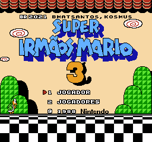
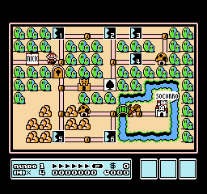
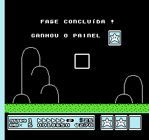
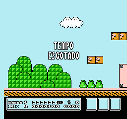
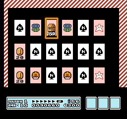

# Super Mario Bros. 3

## Informações sobre o jogo

| Tipo | Informação |
| ----------- | ----------- |
| Nome | [Super Mario Bros. 3](https://www.mobygames.com/game/7300/super-mario-bros-3/) |
| Plataforma | [Nintendo Entertainment System](../../nintendo-entertainment-system/) |
| Desenvolvedora | Nintendo |
| Distribuidora | Nintendo |
| Gênero | Ação / Plataforma |
| Data de Lançamento | 23/10/1988 |

## Informações sobre a tradução

| Tipo | Informação |
| ----------- | ----------- |
| Versão | 1.0 |
| Última versão | Sim |
| URL Youtube | [https://youtu.be/mjS9ja4m6Hc](https://youtu.be/mjS9ja4m6Hc) |
| Data de Lançamento | 03/02/2021 |
| Percentual traduzido | 100% |

## Autores

| Autor(a) | Papel na tradução |
| ----------- | ----------- |
| [BMatSantos](../../../autores/bmatsantos/) | Completo |
| [Kosmus](../../../autores/kosmus/) | Gráficos |

## Informações sobre patching

| Aplicar o patch no arquivo | CRC32 Hash | MD5 Hash |
| ----------- | ----------- | ----------- |
| Super Mario Bros. 3 (USA) (Rev 1) | B742B33 | 86D1982FEA7342C0AF9679DDF3869D8D |

## Páginas sobre a tradução

| URL | Oficial (publicado pelos autores) | Possuí link de download |
| ----------- | ----------- | ----------- |
| [https://www.romhacking.net/translations/5922/](https://www.romhacking.net/translations/5922/) | Sim | Sim |
| [https://www.romhacking.net.br/index.php?topic=1758](https://www.romhacking.net.br/index.php?topic=1758) | Sim | Sim, porém é necessário realizar login |
| [https://joao13traducoes.com/2021/02/nes-super-mario-bros-3-bmatsantos-e-kosmus/](https://joao13traducoes.com/2021/02/nes-super-mario-bros-3-bmatsantos-e-kosmus/) | Não | Sim, porém o arquivo ou página de download exige uma senha |

## Imagens da tradução

