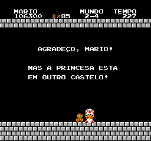

# Super Mario Bros.

## Informações sobre o jogo

| Tipo | Informação |
| ----------- | ----------- |
| Nome | [Super Mario Bros.](https://www.mobygames.com/game/7298/super-mario-bros/) |
| Plataforma | [Nintendo Entertainment System](../../nintendo-entertainment-system/) |
| Desenvolvedora | Nintendo |
| Distribuidora | Nintendo |
| Gênero | Ação / Plataforma |
| Data de Lançamento | 13/09/1985 |

## Informações sobre a tradução

| Tipo | Informação |
| ----------- | ----------- |
| Versão | 1.0 |
| Última versão | Sim |
| URL Youtube | [https://youtu.be/0soSpE17GLc](https://youtu.be/0soSpE17GLc) |
| Data de Lançamento | 21/12/2020 |
| Percentual traduzido | 100% |

## Autores

| Autor(a) | Papel na tradução |
| ----------- | ----------- |
| [BMatSantos](../../../autores/bmatsantos/) | Completo |

## Informações sobre patching

| Aplicar o patch no arquivo | CRC32 Hash | MD5 Hash |
| ----------- | ----------- | ----------- |
| Super Mario Bros. (World) | 3337EC46 | 811B027EAF99C2DEF7B933C5208636DE |

## Páginas sobre a tradução

| URL | Oficial (publicado pelos autores) | Possuí link de download |
| ----------- | ----------- | ----------- |
| [https://www.romhacking.net/translations/5820/](https://www.romhacking.net/translations/5820/) | Sim | Sim |
| [https://www.romhacking.net.br/index.php?topic=1697](https://www.romhacking.net.br/index.php?topic=1697) | Sim | Sim, porém é necessário realizar login |
| [https://joao13traducoes.com/2020/12/nes-super-mario-bros-bmatsantos/](https://joao13traducoes.com/2020/12/nes-super-mario-bros-bmatsantos/) | Não | Sim, porém o arquivo ou página de download exige uma senha |

## Imagens da tradução

