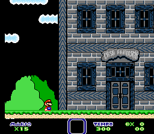

# Super Mario World

## Informações sobre o jogo

| Tipo | Informação |
| ----------- | ----------- |
| Nome | [Super Mario World](https://bootleggames.fandom.com/wiki/Super_Mario_World_(Famicom)) |
| Plataforma | [Nintendo Entertainment System](../../nintendo-entertainment-system/) |
| Desenvolvedora | Hummer Team |
| Distribuidora | J.Y. Company |
| Gênero | Ação / Plataforma |
| Data de Lançamento | 1995 |

## Informações sobre a tradução

| Tipo | Informação |
| ----------- | ----------- |
| Versão | 1.1 |
| Última versão | Sim |
| Data de Lançamento | 03/09/2021 |
| Percentual traduzido | 100% |

## Autores

| Autor(a) | Papel na tradução |
| ----------- | ----------- |
| [Green Jerry](../../../autores/green-jerry/) | Completo |

## Informações sobre patching

| Aplicar o patch no arquivo | CRC32 Hash | MD5 Hash |
| ----------- | ----------- | ----------- |
| Super Mario World (Unl) | 6D5953A8 | 51119C9442135066F1B74AC2ABA789EF |

## Páginas sobre a tradução

| URL | Oficial (publicado pelos autores) | Possuí link de download |
| ----------- | ----------- | ----------- |
| [https://www.romhacking.net/translations/6258/](https://www.romhacking.net/translations/6258/) | Sim | Sim |
| [https://www.romhacking.net.br/index.php?topic=1955](https://www.romhacking.net.br/index.php?topic=1955) | Sim | Sim, porém é necessário realizar login |
| [https://joao13traducoes.com/2021/09/nes-super-mario-world-green-jerry/](https://joao13traducoes.com/2021/09/nes-super-mario-world-green-jerry/) | Não | Sim, porém o arquivo ou página de download exige uma senha |

## Imagens da tradução

