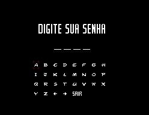

# Disney's Aladdin

## Informações sobre o jogo

| Tipo | Informação |
| ----------- | ----------- |
| Nome | [Disney's Aladdin](https://www.mobygames.com/game/43951/disneys-aladdin/) |
| Plataforma | [Sega Master System](../../sega-master-system/) |
| Desenvolvedora | SIMS Co., Ltd. |
| Distribuidora | SEGA |
| Gênero | Ação / Plataforma |
| Data de Lançamento | 1994 |

## Informações sobre a tradução

| Tipo | Informação |
| ----------- | ----------- |
| Versão | 1.0 |
| Última versão | Sim |
| Data de Lançamento | 15/03/2023 |
| Percentual traduzido | 100% |

## Autores

| Autor(a) | Papel na tradução |
| ----------- | ----------- |
| [SatY](../../../autores/saty/) | Completo |
| [Chatty](../../../autores/chatty/) | Tradução e Gráficos |
| [Anime_World](../../../autores/anime_world/) | Romhacking |
| [Graphicus](../../../autores/graphicus/) | Edição de Fonte |
| [Emuboarding](../../../autores/emuboarding/) | Revisão |

## Informações sobre patching

| Aplicar o patch no arquivo | CRC32 Hash | MD5 Hash |
| ----------- | ----------- | ----------- |
| Aladdin (Europe, Brazil) | C8718D40 | E3F60072028EB6F02C2B0558804AED83 |

## Páginas sobre a tradução

| URL | Oficial (publicado pelos autores) | Possuí link de download |
| ----------- | ----------- | ----------- |
| [https://www.romhacking.net.br/index.php?topic=2364](https://www.romhacking.net.br/index.php?topic=2364) | Sim | Sim, porém é necessário realizar login |
| [https://joao13traducoes.com/2023/03/sms-aladdin-saty-e-cia/](https://joao13traducoes.com/2023/03/sms-aladdin-saty-e-cia/) | Não | Sim, porém o arquivo ou página de download exige uma senha |

## Imagens da tradução

