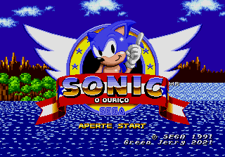
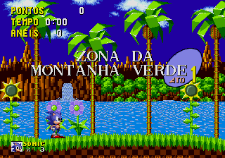
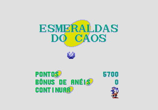
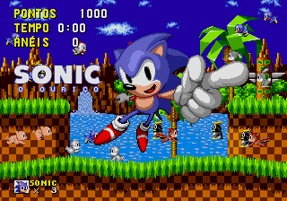
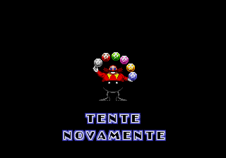

# Sonic the Hedgehog

## Informações sobre o jogo

| Tipo | Informação |
| ----------- | ----------- |
| Nome | [Sonic the Hedgehog](https://www.mobygames.com/game/6579/sonic-the-hedgehog/) |
| Plataforma | [Sega Mega Drive](../../sega-mega-drive/) |
| Desenvolvedora | Sonic Team |
| Distribuidora | SEGA |
| Gênero | Ação / Plataforma |
| Data de Lançamento | 23/06/1991 |

## Informações sobre a tradução

| Tipo | Informação |
| ----------- | ----------- |
| Versão | 1.0 |
| Última versão | Sim |
| Data de Lançamento | 19/02/2021 |
| Percentual traduzido | 100% |

## Autores

| Autor(a) | Papel na tradução |
| ----------- | ----------- |
| [Green Jerry](../../../autores/green-jerry/) | Completo |

## Informações sobre patching

| Aplicar o patch no arquivo | CRC32 Hash | MD5 Hash |
| ----------- | ----------- | ----------- |
| Sonic The Hedgehog (Japan, Europe, Korea) | AFE05EEE | 09DADB5071EB35050067A32462E39C5F |

## Páginas sobre a tradução

| URL | Oficial (publicado pelos autores) | Possuí link de download |
| ----------- | ----------- | ----------- |
| [https://www.romhacking.net/translations/5968/](https://www.romhacking.net/translations/5968/) | Sim | Sim |
| [https://www.romhacking.net.br/index.php?topic=1773](https://www.romhacking.net.br/index.php?topic=1773) | Sim | Sim, porém é necessário realizar login |
| [https://joao13traducoes.com/2021/03/smd-sonic-hedgehog-green-jerry/](https://joao13traducoes.com/2021/03/smd-sonic-hedgehog-green-jerry/) | Não | Sim, porém o arquivo ou página de download exige uma senha |

## Imagens da tradução

