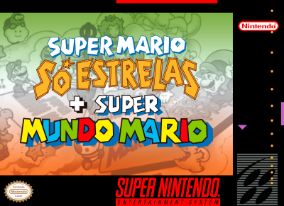
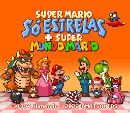
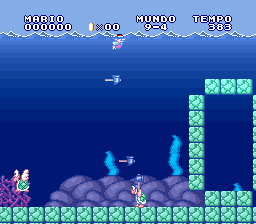
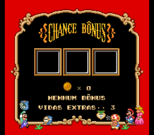
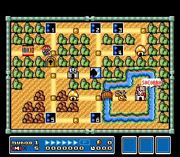
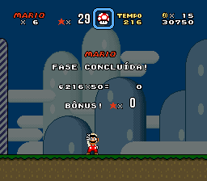

# Super Mario All-Stars + Super Mario World

## Informações sobre o jogo

| Tipo | Informação |
| ----------- | ----------- |
| Nome | [Super Mario All-Stars + Super Mario World](https://www.mobygames.com/game/12679/super-mario-all-stars-super-mario-world/) |
| Plataforma | [Super Nintendo Entertainment System](../../super-nintendo-entertainment-system/) |
| Desenvolvedora | Nintendo |
| Distribuidora | Nintendo |
| Gênero | Ação / Plataforma |
| Data de Lançamento | 12/1994 |

## Informações sobre a tradução

| Tipo | Informação |
| ----------- | ----------- |
| Versão | 1.12 |
| Última versão | Sim |
| URL Youtube | [https://youtu.be/Erv6jHe2PVw](https://youtu.be/Erv6jHe2PVw) |
| Data de Lançamento | 28/12/2022 |
| Percentual traduzido | 100% |

## Autores

| Autor(a) | Papel na tradução |
| ----------- | ----------- |
| [BMatSantos](../../../autores/bmatsantos/) | Completo |
| [Kosmus](../../../autores/kosmus/) | Gráficos |

## Informações sobre patching

| Aplicar o patch no arquivo | CRC32 Hash | MD5 Hash |
| ----------- | ----------- | ----------- |
| Super Mario All-Stars + Super Mario World (USA) | F84305B1 | 7ECAF3E2E021C8A836041C85886F4594 |

## Páginas sobre a tradução

| URL | Oficial (publicado pelos autores) | Possuí link de download |
| ----------- | ----------- | ----------- |
| [https://www.romhacking.net/translations/6765/](https://www.romhacking.net/translations/6765/) | Sim | Sim |
| [https://www.romhacking.net.br/index.php?topic=2279](https://www.romhacking.net.br/index.php?topic=2279) | Sim | Sim, porém é necessário realizar login |

## Imagens da tradução

