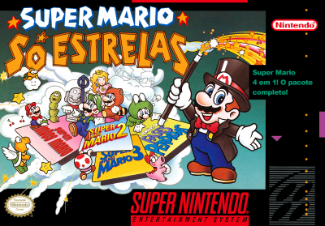
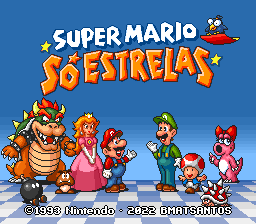
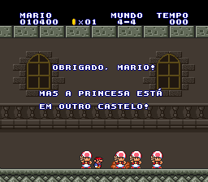
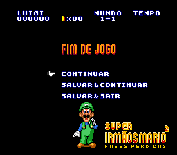
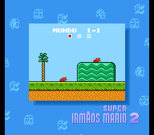
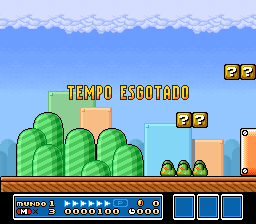

# Super Mario All-Stars

## Informações sobre o jogo

| Tipo | Informação |
| ----------- | ----------- |
| Nome | [Super Mario All-Stars](https://www.mobygames.com/game/6613/super-mario-all-stars/) |
| Plataforma | [Super Nintendo Entertainment System](../../super-nintendo-entertainment-system/) |
| Desenvolvedora | Nintendo |
| Distribuidora | Nintendo |
| Gênero | Ação / Plataforma |
| Data de Lançamento | 14/07/1993 |

## Informações sobre a tradução

| Tipo | Informação |
| ----------- | ----------- |
| Versão | 1.11 |
| Última versão | Sim |
| URL Youtube | [https://youtu.be/ydUpem250vU](https://youtu.be/ydUpem250vU) |
| Data de Lançamento | 26/12/2022 |
| Percentual traduzido | 100% |

## Autores

| Autor(a) | Papel na tradução |
| ----------- | ----------- |
| [BMatSantos](../../../autores/bmatsantos/) | Completo |
| [Kosmus](../../../autores/kosmus/) | Gráficos |

## Informações sobre patching

| Aplicar o patch no arquivo | CRC32 Hash | MD5 Hash |
| ----------- | ----------- | ----------- |
| Super Mario All-Stars (USA) | 925637C7 | 53C038150BA00D5F8D8574B4D36283F2 |

## Páginas sobre a tradução

| URL | Oficial (publicado pelos autores) | Possuí link de download |
| ----------- | ----------- | ----------- |
| [https://www.romhacking.net/translations/6690/](https://www.romhacking.net/translations/6690/) | Sim | Sim |
| [https://www.romhacking.net.br/index.php?topic=2235](https://www.romhacking.net.br/index.php?topic=2235) | Sim | Sim, porém é necessário realizar login |
| [https://joao13traducoes.com/2022/10/snes-super-mario-all-stars-bmatsantos-e-kosmus/](https://joao13traducoes.com/2022/10/snes-super-mario-all-stars-bmatsantos-e-kosmus/) | Não | Sim, porém o arquivo ou página de download exige uma senha |

## Imagens da tradução

