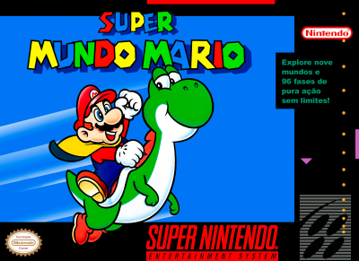
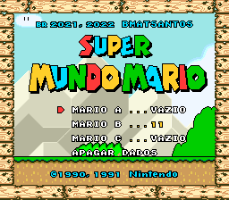
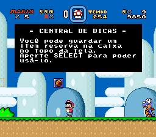
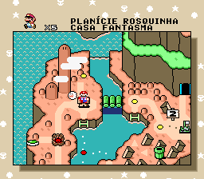
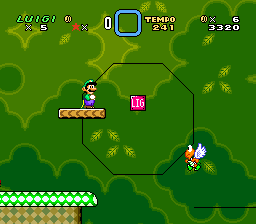
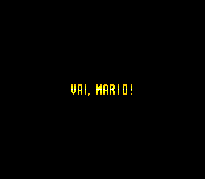

# Super Mario World

## Informações sobre o jogo

| Tipo | Informação |
| ----------- | ----------- |
| Nome | [Super Mario World](https://www.mobygames.com/game/6591/super-mario-world/) |
| Plataforma | [Super Nintendo Entertainment System](../../super-nintendo-entertainment-system/) |
| Desenvolvedora | Nintendo |
| Distribuidora | Nintendo |
| Gênero | Ação / Plataforma |
| Data de Lançamento | 21/11/1990 |

## Informações sobre a tradução

| Tipo | Informação |
| ----------- | ----------- |
| Versão | 2.0 |
| Última versão | Sim |
| URL Youtube | [https://youtu.be/pAMzynd3KX0](https://youtu.be/pAMzynd3KX0) |
| Data de Lançamento | 28/12/2022 |
| Percentual traduzido | 100% |

## Autores

| Autor(a) | Papel na tradução |
| ----------- | ----------- |
| [BMatSantos](../../../autores/bmatsantos/) | Completo |
| [Uão](../../../autores/uao/) | Revisão |

## Informações sobre patching

| Aplicar o patch no arquivo | CRC32 Hash | MD5 Hash |
| ----------- | ----------- | ----------- |
| Super Mario World (USA) | B19ED489 | CDD3C8C37322978CA8669B34BC89C804 |

## Páginas sobre a tradução

| URL | Oficial (publicado pelos autores) | Possuí link de download |
| ----------- | ----------- | ----------- |
| [https://www.romhacking.net/translations/6036/](https://www.romhacking.net/translations/6036/) | Sim | Sim |
| [https://www.romhacking.net.br/index.php?topic=1825](https://www.romhacking.net.br/index.php?topic=1825) | Sim | Sim, porém é necessário realizar login |

## Imagens da tradução

